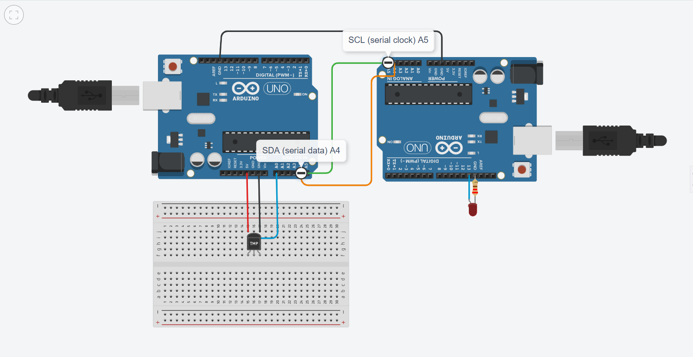
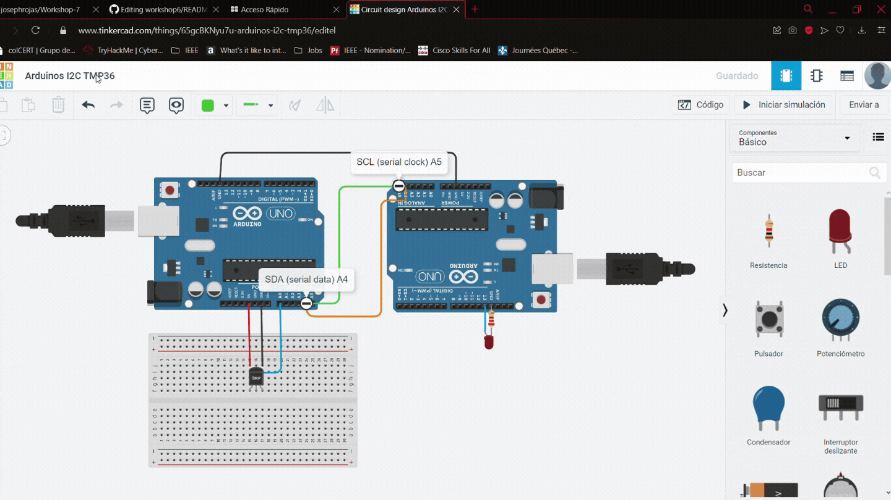

# Workshop 7
Séptimo workshop de la materia de automatización y control de procesos

- [Workshop6](#workshop6)
  - [Sensor](#sensor)
  - [Sistema Embebido](#sistema-embebido)
    - [Hardware](#hardware)
  - [Conectividad](#conectividad)
    - [Conectividad física](#conectividad-física)
    - [Protocolo de comunicación](#protocolo-de-comunicación)
    - [Protocolo de aplicación](#protocolo-de-aplicación)
  - [Montaje](#montaje)
    - [Simulación](#simulación)
    - [Implementación física](#implementación-física)

## Sensor
## Sistema embebido
### Hardware
## Conectividad
### Conectividad física
### Protocolo de comuniación
## Montaje
### Simulación
Para la simulación se usó el software TInkercad, con el cual se procedió a realizar el siguietne montaje:

En donde se puede evidenciar la siguiente implementacion

### Implementación física
